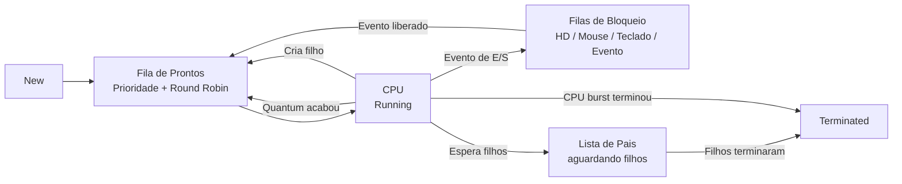
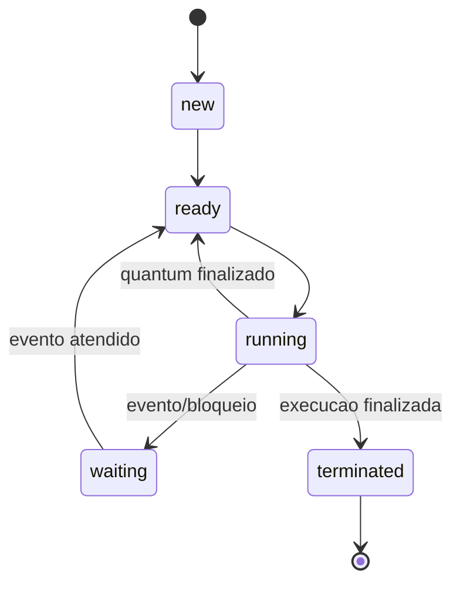

# ⚙️ Simulador de Ciclo de Vida de Processos

<p align="left">
  
  
  
  
  
</p>

Projeto acadêmico de **Sistemas Operacionais** desenvolvido em **C** para simular o ciclo de vida de processos dentro de um sistema operacional.

A aplicação trabalha com criação de processos, escalonamento, uso de CPU, bloqueios por eventos de entrada/saída, criação de processos filhos e finalização com relatórios estatísticos.

## 🎯 Objetivo

O objetivo do projeto é representar, de forma prática, como um processo pode transitar entre os principais estados do seu ciclo de vida:

- `new`
- `ready`
- `running`
- `waiting`
- `terminated`

A simulação usa estruturas de dados implementadas manualmente, como listas encadeadas e filas, aproximando o trabalho de conceitos vistos em Estrutura de Dados e Sistemas Operacionais.

## ✨ Funcionalidades

- Criação automática e manual de processos.
- Simulação de CPU com **quantum base 10**.
- Fila de prontos com prioridade.
- Filas FIFO para processos bloqueados.
- Bloqueio por eventos de:
  - disco/HD;
  - mouse;
  - teclado;
  - evento genérico.
- Criação de processos filhos durante a execução.
- Controle de processos pais aguardando a finalização dos filhos.
- Transição de processos entre `ready`, `running`, `waiting` e `terminated`.
- Relatórios finais da simulação.
- Liberação de memória ao final da execução.

## 🧠 Conceitos Aplicados

- Ciclo de vida de processos.
- Escalonamento com Round Robin.
- Quantum de CPU.
- Filas FIFO.
- Fila de prioridade.
- Lista encadeada.
- Processos pai e filho.
- Bloqueio e desbloqueio por eventos.
- Cálculo de tempo de execução, espera e bloqueio.

## 🧱 Arquitetura da Simulação



## 🔄 Estados do Processo



## 🗃️ Estruturas Criadas

### `Proc`

Representa um processo da simulação.

Guarda informações como:

- PID do processo.
- PID do processo pai.
- prioridade.
- tempo de CPU.
- tempo de execução.
- tempo de espera.
- tempo de bloqueio.
- estado atual.
- lista de processos filhos.

### `ProcF`

Representa um item da lista de filhos de um processo.

Essa estrutura permite que um processo pai saiba quais filhos ainda precisam ser finalizados antes que ele possa ir para `terminated`.

### `Fila`

Representa as filas usadas pela simulação.

É utilizada para:

- fila de prontos;
- fila de bloqueio por HD;
- fila de bloqueio por mouse;
- fila de bloqueio por teclado;
- fila de bloqueio por evento;
- fila de processos terminados;
- lista de pais aguardando filhos.

## 🖼️ Diagramas das Structs

### Struct do Processo


### Struct da Fila


## 📊 Relatórios Gerados

Ao final da simulação, o programa exibe:

- quantidade de processos terminados;
- quantidade de processos bloqueados;
- tempo médio de bloqueio;
- processos que alternaram entre execução e pronto sem bloqueio;
- lista de processos terminados;
- processos que criaram filhos.

## 🛠️ Tecnologias Utilizadas

- **Linguagem C**
- **GCC / MinGW**
- **Windows Console**
- **Estruturas de dados manuais**

> O projeto usa `conio.h` e `windows.h`, então foi pensado para execução no Windows.

## 📁 Estrutura do Projeto

```text
TrabalhoSO/
├── main.c
├── TAD_filas.h
├── build.bat
├── desenho da struct fifo.png
├── desenho da struct processo.png
├── Projeto Pratico SO1-CicloVidaProcesso.pdf
├── Trabalho Pratico SO - Ciclo de Vida Dos Processos.docx
└── README.md
```

## 🚀 Como Compilar

Com o GCC/MinGW instalado e disponível no `PATH`, execute:

```powershell
gcc main.c -o processo_simulador.exe
```

Ou use o script:

```powershell
.\build.bat
```

## ▶️ Como Executar

```powershell
.\processo_simulador.exe
```

Ao iniciar, informe o tempo de execução da simulação. Durante a execução, o programa mostra a CPU, as filas de processos, os eventos possíveis e as transições entre estados.

## 👥 Desenvolvedores

- Cauã Toninato
- Gustavo Imada
- Luiz Carlos
- Raul Santos

## 🧹 Organização do Repositório

O repositório versiona o código-fonte, documentação e imagens explicativas.

Executáveis (`.exe`) e arquivos compactados de entrega (`.zip`, `.rar`, `.7z`) ficam fora do Git, porque podem ser recriados a partir do código.

## 🔮 Melhorias Futuras

- Separar implementação e assinaturas em `.c` e `.h`.
- Criar uma versão portável para Linux/macOS sem `conio.h` e `windows.h`.
- Permitir configuração do quantum pela entrada do usuário.
- Gerar logs da simulação em arquivo.
- Adicionar testes unitários para as operações de fila.
